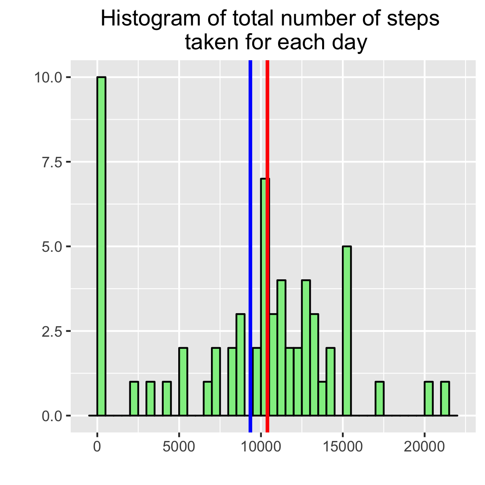
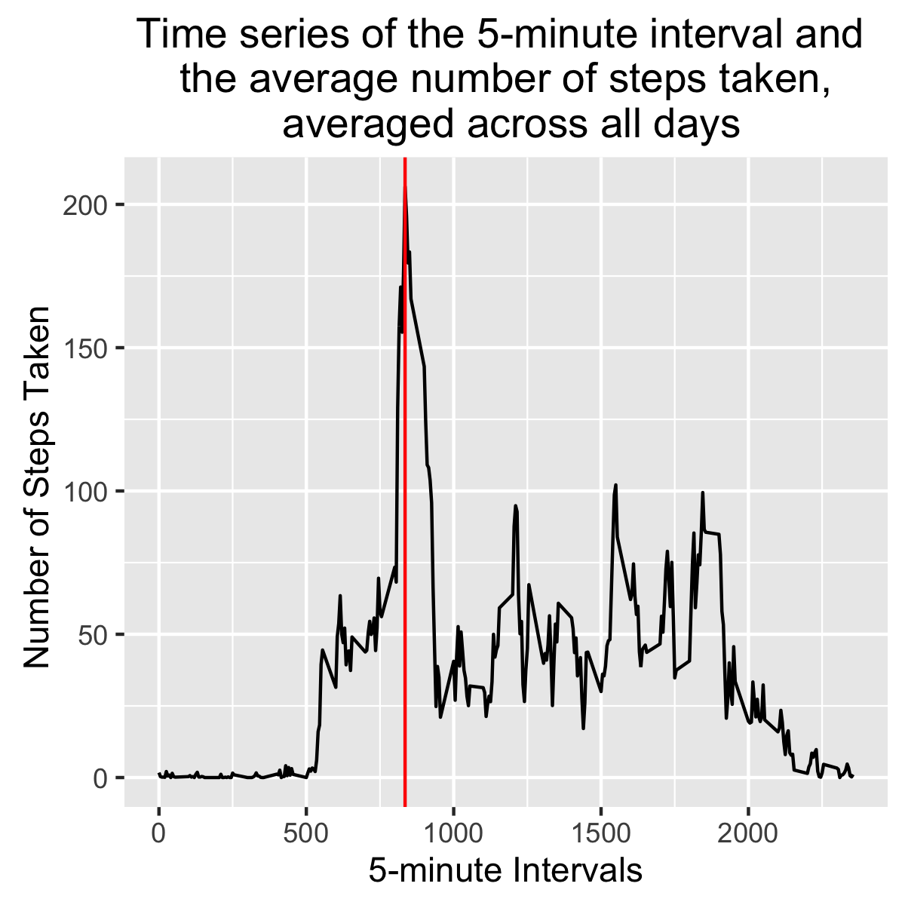
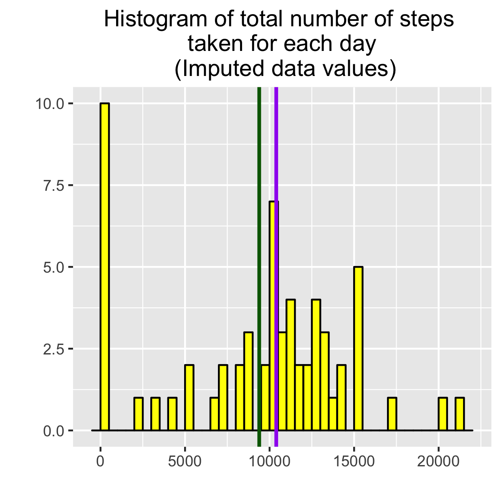
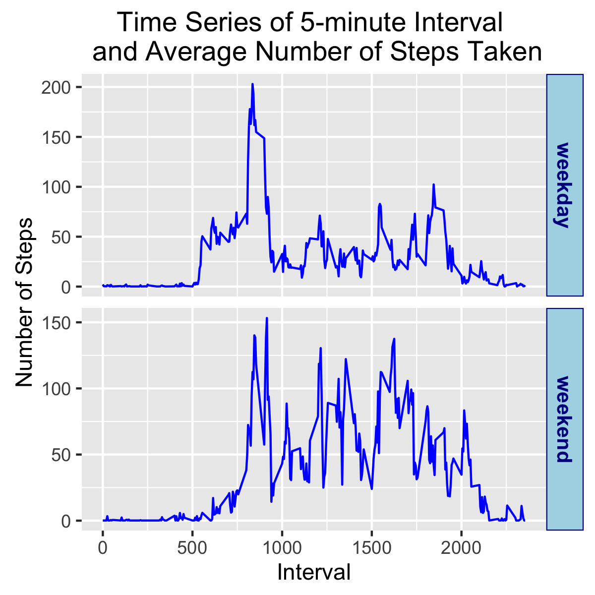

# Reproducible Research: Peer Assessment 1


## Loading and preprocessing the data

To begin our analysis, we must load the activity monitor dataset, stored in CSV format, into the global environment.


```r
library(dplyr)
```

```
## 
## Attaching package: 'dplyr'
```

```
## The following objects are masked from 'package:stats':
## 
##     filter, lag
```

```
## The following objects are masked from 'package:base':
## 
##     intersect, setdiff, setequal, union
```

```r
library(ggplot2) 

# Read the activity CSV file to dataframe
activityMonitorData <- read.csv(file="activity.csv", header=TRUE, sep=",")
```

The personal activity monitor data is now available for analysis using R functions generated to answer the questions identify patterns and trends pertaining to personal movement during 5 minute intervals.

## What is mean total number of steps taken per day?

The mean total number of steps taken per day is 9354.  The median total number of steps per day is 10395.

This value was calculated by grouping the personal movement data by date and aggregating on the steps.  Once the data is aggregated, the mean and median of the steps is calculated.  A histogram was generated using ggplot to visualize the steps taken each day. The calculated mean and median is used by ggplot to draw a lines representing these values respectively.

\




## What is the average daily activity pattern?

The average daily activity pattern is presented in the time series plot below. This plot observes the average number of steps taken each day at 5-minute intervals.  The average was calculated across all days.  The maximum number of steps is 835.  The red vertical line represents the maximum number of step on the graph.


```r
activityPattern <- aggregate(activityMonitorData[c("steps")], by=activityMonitorData[c("interval")], FUN=mean, na.rm=TRUE) 

#  Which 5-minute interval, on average across all the days in the dataset, contains the maximum number of steps?
maxNbrStepsInterval <- activityPattern$interval[activityPattern$steps==max(activityPattern$steps)]

#  Make a time series plot (i.e. 𝚝𝚢𝚙𝚎 = "𝚕") of the 5-minute interval (x-axis) and the average number of 
#  steps taken, averaged across all days (y-axis)
ggplot(activityPattern, aes(interval,steps)) + 
        geom_line() + 
        geom_vline(xintercept = maxNbrStepsInterval, color = "red", linetype = "solid", size = .5) + 
        labs(title = "Time series of the 5-minute interval and \n the average number of steps taken, \n averaged across all days") + 
        labs(x = "5-minute Intervals", y = "Number of Steps Taken ")
```

\

```r
# Save plot timeSeriesStepIntrvlPlot.png
ggsave(filename="timeSeriesStepIntrvlPlot.png", height=4, width=4)
```




## Imputing missing values

The presence of missing days has the potential of introducing bias when performing some calculations and/or generating data summaries.  To avoid bia, implemented a strategy to update steps with value of NA with the result of mean of total steps/median of total step ( 0.899 = 9354/10395).

The total number of missing values in the dataset is 2304.
The mean of total steps is 9354.
The median of total steps is 10395.


```r
# Calculate and report the total number of missing values in the dataset (i.e. the total number of rows with 𝙽𝙰s)
totalNbrRowMissingSteps <- sum(is.na(activityMonitorData$steps))

# Devise a strategy for filling in all of the missing values in the dataset. The strategy does not need to be sophisticated. 
# For example, you could use the mean/median for that day, or the mean for that 5-minute interval, etc.
seedValue <- totalMean/totalMedian

# Create a new dataset that is equal to the original dataset but with the missing data filled in.
imputedActivityMonitorData <- activityMonitorData
imputedActivityMonitorData$steps <- ifelse(is.na(activityMonitorData$steps), seedValue, activityMonitorData$steps)

# Calculate and report the mean and median total number of steps taken per day.
imputedTotalNumberSteps <- aggregate(imputedActivityMonitorData[c("steps")], by=imputedActivityMonitorData[c("date")], FUN=sum, na.rm=TRUE)  
imputedTotalMean <- mean(imputedTotalNumberSteps$steps)
imputedTotalMedian <- median(imputedTotalNumberSteps$steps)

# Make a histogram of the total number of steps taken each day 
ggplot(imputedTotalNumberSteps, aes(x = steps)) + 
        geom_histogram(stat = "bin", binwidth = 500, bins = 100, fill = "yellow", color = "black") + 
        geom_vline(xintercept = imputedTotalMean, color = "dark green", linetype = "solid", size = 1) + 
        geom_vline(xintercept = imputedTotalMedian, color = "purple", linetype = "solid", size = 1) + 
        labs(title = "Histogram of total number of steps \n taken for each day \n (Imputed data values)") + 
        labs(x = "", y = "")
```

\

```r
# Save plot imputedTtlStepsTakenEachDayPlot
ggsave(filename="imputedTtlStepsTakenEachDayPlot.png", height=4, width=4)
```




## Are there differences in activity patterns between weekdays and weekends?

To determine if there are differences in activity patterns, an additional column was added to the imputed activity monitor data to indicate whether the activity data was recorded during the week or during the weekend.  A panel plot was generated using ggplot presenting the data in time series plot recording 5-minute intervals and the average number of step taken accross all days occurring during the week or week's end. 

The time series plots shows step activity began to peak during the weekday at 50 steps, 510 interval and reached its peak at 205 steps, 800 interval. Weekend activity pattern indicate step activity did not begin to peak until 25 steps, 750 interval and reached it peak at 155 steps, 900 interval.  Interestingly, weekend step activity spiked more frequently than weekday activity.   


```r
# Create a new factor variable in the dataset with two levels – “weekday” and “weekend” indicating whether a given date is a weekday or weekend day.
dayTypeActivityPattern <- imputedActivityMonitorData
dayTypeActivityPattern$daytype <- ifelse(weekdays(as.Date(dayTypeActivityPattern$date)) == "Saturday" | 
                                                 weekdays(as.Date(dayTypeActivityPattern$date)) == "Sunday",
                                         "weekend","weekday")
dayTypeActivityPattern <- aggregate(dayTypeActivityPattern[c("steps")], by=dayTypeActivityPattern[c("interval","daytype")], FUN=mean, na.rm=TRUE) 

# Make a panel plot containing a time series plot (i.e. 𝚝𝚢𝚙𝚎 = "𝚕") of the 5-minute interval (x-axis) and the average number of steps t
# taken, averaged across all weekday days or weekend days (y-axis). See the README file in the GitHub repository to see an example 
# of what this plot should look like using simulated data.
ggplot(dayTypeActivityPattern, aes(interval, steps),) + 
        geom_line(color="blue") +
        facet_grid(daytype~., scales="free") +
        theme(strip.text.y = element_text(color="dark blue", size=10, face="bold"),
              strip.background = element_rect(color="dark blue", fill="light blue")) +
        labs(title = "Time Series of 5-minute Interval \n and Average Number of Steps Taken") +
        labs(x = "Interval", y = "Number of Steps")
```

\

```r
# Save plot dayTypeActivityPatternPlot
ggsave(filename="dayTypeActivityPatternPlot.png", height=4, width=4)
```



